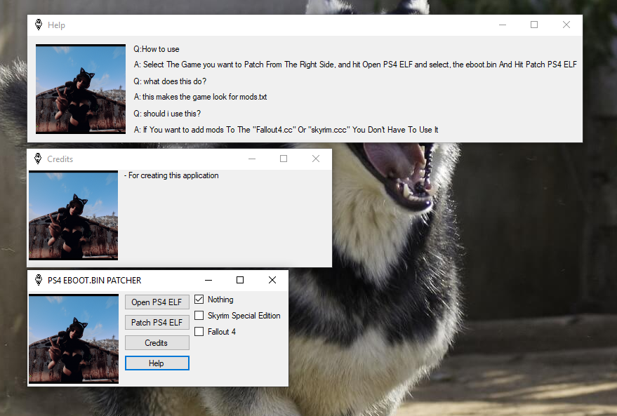
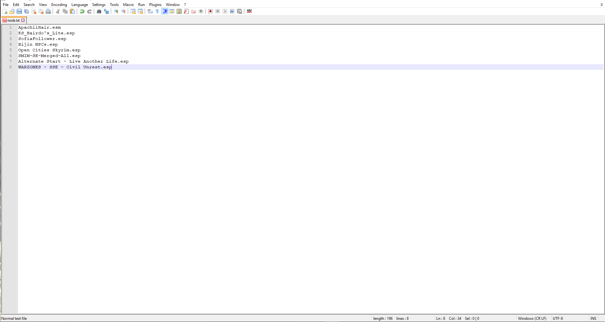

# EBOOT.BIN-ELF-Patcher
This Will Patch the eboot.bin of Skyrim and Fallout 4, This allows you to patch Skyrim Special Edition and fallout 4 to look for "mods.txt".

------------------------------------------------------------------------------------------------------------------------------------------
side notes, ESM must be first ESP 2nd and ESL 3rd.
For a example ill show you what it should look like this:

