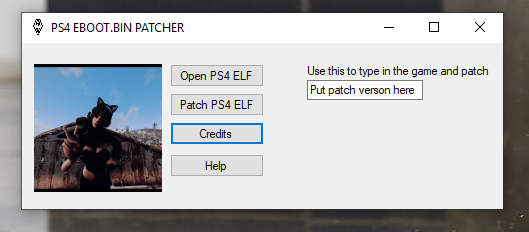
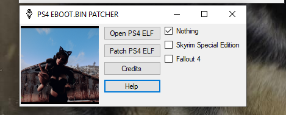

I Redid the UI/GUI as many where saying they didn't like it, i also made it easier to add other patches

and the old

------------------------------------------------------------------------------------------------------------------
examples of patches include: "US skyrim 1.09" & "US skyrim 1.08" & "US fallout 4 1.22", others are coming soon, if you want to help speed up the process send me the eboot.bin of older fallout 4 updates(1.21, 1.20, etc)
